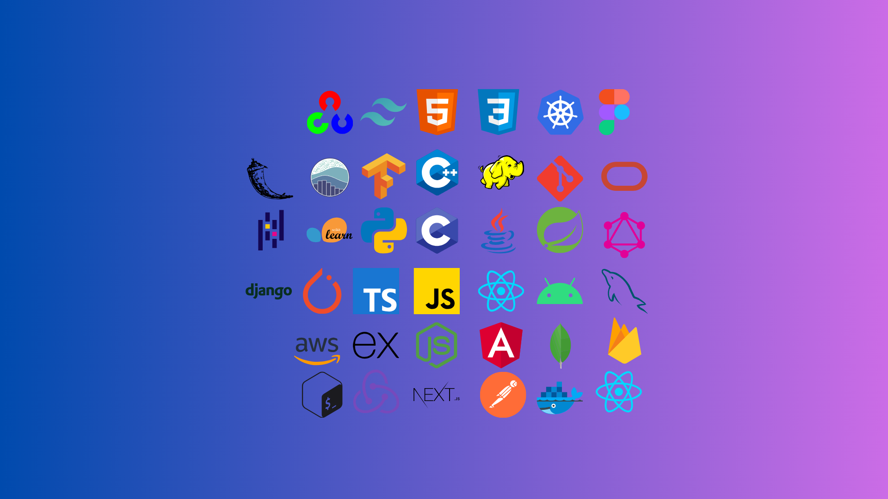

<h1 align="center">Hii 👋, I'm Ravi Rathore</h1>

<h3 align="center">A Proficient Programmer, software Developer and a fast learner</h5>

<h2 align="left">Some Facts About Me</h2>

- 🔭 I’m currently doing Programming and stuffs
- 📫 How to reach me: [sirravirathore@gmail.com](mailto:sirravirathore@gmail.com)

<h2 align="left">Connect with Me
<!-- 
 

</h2> -->

   
 
  

<h2 align="left">Skillset</h2>

### Programming Languages:

| C | C++ | JavaScript | Python |
|----------|----------|----------|----------|
|  |  |  |  |

### Frontend Development:

| React.js | HTML | CSS | 
|----------|----------|----------|
|  |  |  |

### Backend Development:

| Node.js | Express.js |
|----------|----------|
|  |  |

### Mobile App Development:

| Android | React Native |
|----------|----------|
|  |  |

### Database Management:

| MongoDB | MySQL | Oracle |
|----------|----------|----------|
|  |  |  |

 
 

  

    
  
  

  
  

   

